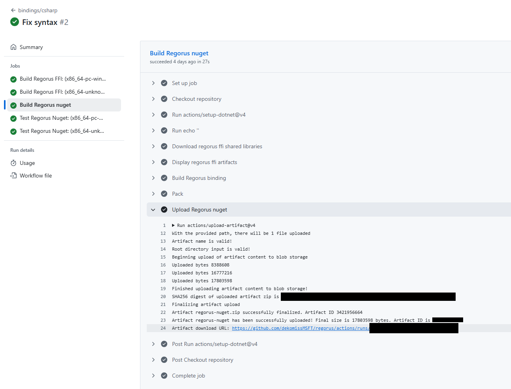

# Regorus CSharp

**Regorus** is

  - *Rego*-*Rus(t)*  - A fast, light-weight [Rego](https://www.openpolicyagent.org/docs/latest/policy-language/)
   interpreter written in Rust.
  - *Rigorous* - A rigorous enforcer of well-defined Rego semantics.

See main [Regorus page](https://github.com/microsoft/regorus) for more details about the project.

# Building

## Github Actions

The simplest way to build a Nuget for Regorus' C# bindings is to use Github Actions. The action to do so is named `bindings/csharp` and is defined in `.github/workflows/test-csharp.yml`.

There are two ways to trigger a Nuget build.
1. Runs are triggered automatically whenever a push or pull request is made to the `main` branch.
2. A run can be triggered manually by navigating to the action in the Github UI and clicking `Run workflow`. This option allows you to generate a Nuget for any branch, which is useful when testing the integration of in-progress changes to Regorus with other projects. Nuget files that are generated via this flow will have a `manualtrigger` suffix appended to their version number, making it easy to distinguish them from Nugets generated using the `main` branch.

Once the workflow run completes, the generated Nuget can be downloaded by following these steps:
1. Open the run.
2. Click on `Build Regorus nuget` on the left.
3. Expand the `Upload Regorus nuget` step.
4. Click the `Artifact download URL` link at the bottom.
5. Save and extract the downloaded zip file to find the `.nupkg` file.

## Local

TODO
